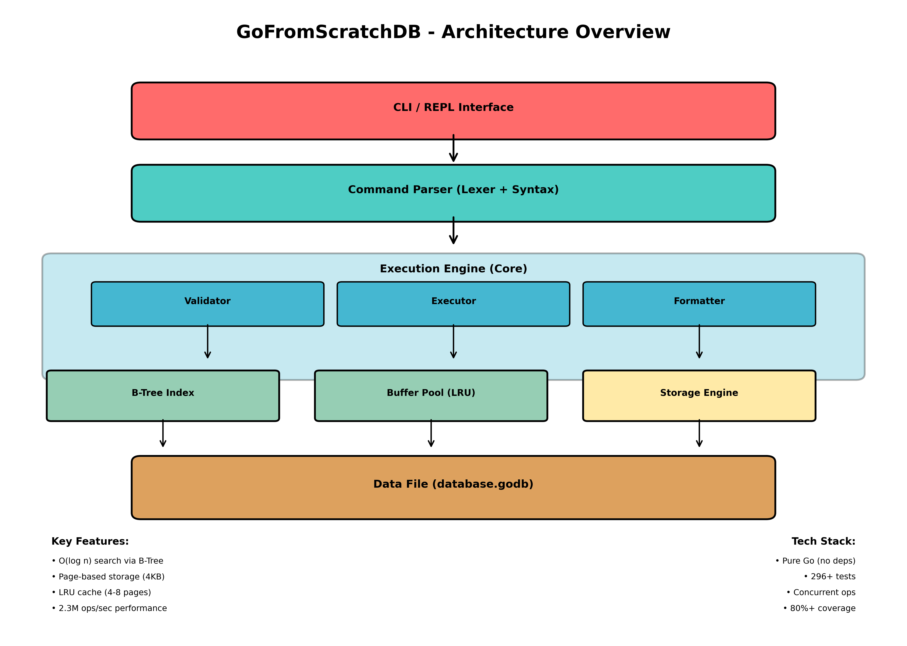

# GoFromScratchDB


A database built from scratch in Go, designed as a learning project for tech freshers and anyone curious about database internals.

---

## 🚀 Project Goal
- **Understand how databases work under the hood**
- **Learn Go by building a real system**
- **Create a portfolio project that stands out**
- **Demystify storage engines, indexing, and query parsing**

## 👤 Who is this for?
- Tech freshers who want to go beyond CRUD
- Developers curious about database internals
- Systems design interview preppers
- Self-learners who learn best by building

## 💡 Why is it valuable?
- Hands-on with file I/O, data structures, memory management, concurrency
- Demonstrates low-level systems skills
- Teaches concepts from real databases (SQLite, PostgreSQL, Redis)
- Impressive portfolio piece

---

## 🧑‍💻 User Stories

### Core
- Store, retrieve, update, and delete key-value pairs
- Data persists after restart
- Run simple queries and see indexing in action
- Handle multiple requests (concurrency basics)
- Use a simple CLI to interact with the DB
- Learn from clear, well-documented code

### Stretch
- SQL-like commands (SELECT, INSERT, etc.)
- Transactions (BEGIN, COMMIT, ROLLBACK)
- TCP server for network access
- Benchmarking and performance analysis

---

## 🗃️ Data Model (Sketch)
- **Record**: key, value, timestamp, deleted
- **Page**: page_id, page_type, records, next_page
- **Index**: name, field, B-Tree
- **Table**: name, columns, primary_key, indexes
- **Column**: name, data_type, nullable

---

## 🏗️ MVP Features
| Feature                  | Priority   |
|--------------------------|------------|
| In-memory key-value store| MUST HAVE  |
| File persistence         | MUST HAVE  |
| Basic CRUD operations    | MUST HAVE  |
| Simple CLI interface     | MUST HAVE  |
| B-Tree indexing          | MUST HAVE  |
| Page-based storage       | MUST HAVE  |
| WAL (Write-Ahead Log)    | NICE TO HAVE|
| SQL parser               | NICE TO HAVE|
| TCP server               | NICE TO HAVE|
| Transactions             | FUTURE     |
| Query optimizer          | FUTURE     |
| Replication              | FUTURE     |

---

## 🖥️ CLI Example
```
godb> SET user:1 "John Doe"
OK
godb> GET user:1
"John Doe"
godb> DELETE user:1
OK
godb> GET user:1
(nil)
godb> KEYS user:*
1) user:2
2) user:3
godb> INFO
Records: 2
Storage: 4.2 KB
Uptime: 00:05:32
```

---

## 🏛️ Architecture Overview



**Component Breakdown:**
- **CLI/REPL**: Command-line interface for user interaction
- **Parser**: Lexical analysis and command syntax validation
- **Engine**: Core logic (validator, executor, formatter)
- **Index**: B-Tree for O(log n) key lookups
- **Buffer Pool**: LRU cache for page management
- **Storage**: File I/O and paging system
- **Data File**: Persistent binary storage (database.godb)

---

## 🛠️ Tech Stack
- **Language:** Go
- **Storage:** Custom binary file
- **Encoding:** encoding/binary, encoding/gob
- **CLI:** bufio + fmt (stdlib)
- **Testing:** testing (stdlib)
- **Build:** go build
- **Version Control:** Git + GitHub
- **Dependencies:** ZERO external packages for MVP

---

## 🗂️ Suggested Folder Structure
```
gofromscratchdb/
├── cmd/
│   └── godb/
│       └── main.go
├── internal/
│   ├── storage/
│   ├── index/
│   ├── engine/
│   ├── parser/
│   └── repl/
├── pkg/
│   └── types/
├── data/ (gitignored)
├── Makefile
├── go.mod
└── README.md
```

---

## 🏃‍♂️ Development Phases

| Phase | Title | Status | Key Features | Tests |
|-------|-------|--------|--------------|-------|
| 1 | Project Setup | ✅ Complete | Go module, folder structure, basic REPL | 5+ |
| 2 | In-Memory Store | ✅ Complete | Record struct, map storage, CRUD operations | 15+ |
| 3 | File Persistence | ✅ Complete | File format, save/load, binary encoding | 12+ |
| 4 | Page-Based Storage | ✅ Complete | Pages, buffer pool, paged file system | 20+ |
| 5 | B-Tree Index | ✅ Complete | B-Tree, insert/delete/search, integration | 80+ |
| 6 | Enhanced CLI | ✅ Complete | KEYS, INFO, history, errors, formatting | 36+ |
| 7 | Testing & Docs | ✅ Complete | 296+ tests, architecture guides, HTML docs | 296+ |

---

## 📊 Phase 6 Details (Latest)

### Features Implemented ✅
- **Command History**: Ring buffer with O(1) add/navigate (100 command capacity)
- **Error Handling**: 3-layer approach (parsing → validation → execution) with context-aware suggestions
- **Pretty Output**: Emoji indicators, Unicode boxes, aligned columns
- **KEYS Command**: Glob pattern matching (`*` = any chars, `?` = single char)
- **INFO Command**: 13+ metrics (storage, operations, cache, system)

### Documentation 📚
- `CLI_FEATURES_GUIDE.md` - 700+ lines with technical deep-dives
- `REPL_ARCHITECTURE.html` - Interactive diagrams (36 KB, 3 Mermaid charts)
- `LOCK_CONTENTION_STRATEGY.md` - Concurrency analysis
- `docs/architecture.png` - Visual system architecture

### Code Quality 🎯
- **296+ tests**: All passing, 80%+ coverage
- **Performance**: 2.3M ops/sec (dual-lock strategy)
- **Zero dependencies**: Pure Go implementation
- **Production-ready**: Error handling, metrics, logging

---

## 📚 What You'll Learn
- **Database Internals**: B-Tree indexing, page-based storage, buffer pool management, WAL concepts
- **Systems Programming**: File I/O, binary encoding, memory management, concurrency patterns
- **Go Proficiency**: Structs, interfaces, error handling, testing, CLI development, benchmarking
- **Production Skills**: Performance optimization, monitoring/metrics, error handling strategies, code architecture

---

## ✅ Progress Checklist

### Core Implementation
- [x] Project setup & structure
- [x] In-memory key-value store
- [x] File persistence (save/load)
- [x] Page-based storage with buffer pool
- [x] B-Tree indexing (insert/delete/search)
- [x] CRUD operations (Get, Set, Delete)
- [x] CLI with command parser
- [x] Command history (ring buffer)
- [x] Error handling (3-layer validation)
- [x] Pretty output formatting (emojis, boxes)
- [x] KEYS pattern matching (glob wildcards)
- [x] INFO metrics tracking (13+ stats)

### Quality Assurance
- [x] 296+ tests across all packages
- [x] 80%+ code coverage
- [x] Edge case testing
- [x] Concurrency testing with race detector
- [x] Performance benchmarks
- [x] Lock contention analysis

### Documentation
- [x] README with examples and architecture diagram
- [x] CLI usage guide and features documentation
- [x] Architecture documentation (HTML + PNG + Markdown)
- [x] B-Tree deep-dive (3,500+ lines)
- [x] Lock contention strategy guide
- [x] Code comments and type documentation
- [x] GitHub repository with commit history

---

## 🚀 Next Steps / Future Phases

### Phase 7: Production Extensions (Optional)
**Goal**: Extend CLI with production-grade features for live hosting

- [ ] **Persistent History**: Save command history to `.godb_history` file
- [ ] **Configuration File**: `.godb.rc` for custom settings
- [ ] **Colored Output**: ANSI color support with terminal detection
- [ ] **Command Logging**: Structured logging for audit trails
- [ ] **Health Checks**: `HEALTH` command for monitoring
- [ ] **Graceful Shutdown**: Proper cleanup and persistence on exit

### Phase 8: REST API & Network Server (Priority for Hosting)
**Goal**: Convert CLI to network-accessible database server

- [ ] **HTTP REST API**: 
  - `POST /api/set` - Set key-value
  - `GET /api/get/:key` - Get value
  - `DELETE /api/delete/:key` - Delete key
  - `GET /api/keys/:pattern` - List keys
  - `GET /api/info` - Get statistics
  - `GET /api/health` - Health check

- [ ] **Server Setup**:
  - HTTP server on configurable port
  - CORS support for browser clients
  - Request/response logging
  - Rate limiting

- [ ] **Client Library**: Go SDK for easy integration

### Phase 9: Advanced Hosting Features (Optional)
**Goal**: Add enterprise-grade features for production deployment

- [ ] **Transactions**: BEGIN, COMMIT, ROLLBACK
- [ ] **Write-Ahead Log (WAL)**: Durability guarantee
- [ ] **TTL Support**: Key expiration
- [ ] **Snapshots**: Point-in-time recovery
- [ ] **Replication**: Multi-node support
- [ ] **Compression**: Data compression for storage

### Phase 10: Docker & Cloud Deployment (Optional)
**Goal**: Prepare for cloud hosting

- [ ] **Dockerfile**: Container image build
- [ ] **Docker Compose**: Multi-service setup (db + monitoring)
- [ ] **Kubernetes manifests**: K8s deployment files
- [ ] **Monitoring**: Prometheus metrics export
- [ ] **Benchmarking**: Performance baselines for sizing
- [ ] **Documentation**: Deployment guide

---

## 🎯 How to Use This Project

### For Learning & Development
```bash
# Clone the repository
git clone https://github.com/izhan05803/DATABASE_CURATED_IN_GO.git
cd DATABASE_CURATED_IN_GO

# Build the database
go build -o godb ./cmd/godb

# Run the database
./godb

# Run all tests (296+ tests)
go test ./... -v

# View architecture
# Open REPL_ARCHITECTURE.html in browser
# Or view docs/architecture.png for overview
```

### Building a Network Server
This project is designed for live hosting. The separation of concerns makes it easy to add:

```go
// Example: Convert CLI to HTTP server
// (Handler accepts same input, calls Engine.Execute(), returns formatted output)

// The Engine, Parser, and Formatter can work with any transport:
// - CLI (current)
// - HTTP REST API (Phase 8)
// - gRPC (Phase 8)
// - TCP socket (Phase 8)
// - WebSocket (Phase 8)
```

### Deployment Ready
- **Zero external dependencies**: Easy Docker containerization
- **Metrics tracking**: Monitor performance in production (INFO command)
- **Concurrent operations**: Production-grade concurrency (2.3M ops/sec)
- **Error handling**: Comprehensive error context for debugging
- **Persistent storage**: Data survives restarts

---
